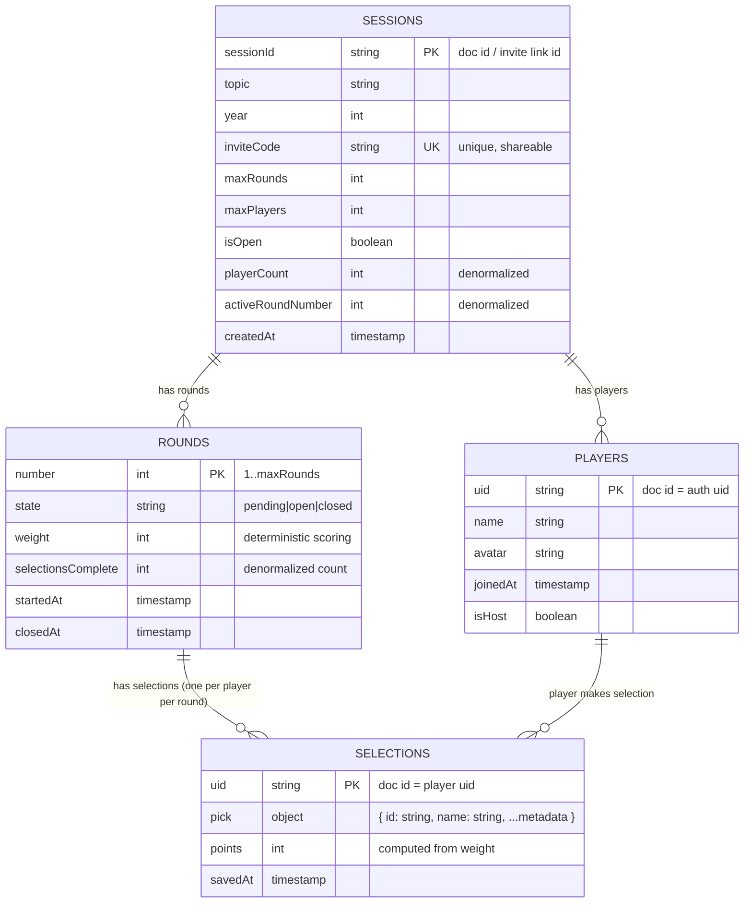

# Schema



## Structure

User clicks Start, let up to ~10 ephemeral players join, store one pick per player per round with deterministic weighted points, and delete the entire session tree after round 10.

**Path hierarchy** (Firestore subcollections):

- `sessions/{sessionId}`
- `sessions/{sessionId}/players/{uid}`
- `sessions/{sessionId}/rounds/{roundNumber}`
- `sessions/{sessionId}/rounds/{roundNumber}/selections/{uid}`

**Collections:**

- **sessions**: single doc to share (invite link), holds rules (maxRounds/maxPlayers) and scope for all session data. Denormalized counts for quick reads.
- **players**: subcollection under sessions. Session-scoped snapshots (name/avatar) with no foreign keys - relationship is through path hierarchy. No global users collection to clean up.
- **rounds**: subcollection under sessions. Explicit round docs with weight stored so scoring is deterministic and simple. Track completion count to know when round is done.
- **selections**: subcollection under rounds. One doc per player per round (doc id = uid) storing pick and points so final tally is just a sum. PK is implicitly `(roundNumber, uid)` via path.

**Relationships via path hierarchy** - no foreign keys needed. Deleting a session cascades to all subcollections (players, rounds, selections). Query players with `sessions/{sessionId}/players`.

**Timestamps and storing points at write-time make ordering, auditing, scoring, and cleanup straightforward.**

## Constraints & Validation

- `inviteCode` must be unique across all active sessions
- `pick.id` must be unique within each round (prevent duplicate picks)
- Transactions enforce: validate uniqueness → write selection → increment `selectionsComplete`
- Security rules enforce: only host can transition round states, players can only write their own selection once per round
- Round state transitions are atomic: `pending` → `open` (host action) → `closed` (auto when selectionsComplete == playerCount OR host forces)

## Indexes

```
sessions: (isOpen, createdAt)          // cleanup jobs
rounds: (state, number)                // query active round
selections: (savedAt)                  // leaderboard ordering
```

## Moving Forward: Firestore

Going with Firestore because it solves the hard parts out of the box:

1. **Real-time sync** - players see picks instantly, no polling
2. **Hierarchical cleanup** - delete session root, everything cascades
3. **Security rules** - declarative access control, no backend auth logic
4. **Offline support** - works on spotty connections
5. **Native mobile SDKs** - first-class React Native/Expo support

The structure maps 1:1 to subcollections, transactions prevent race conditions on duplicate picks, and TTL policies handle abandoned sessions. We can ship the MVP with minimal backend code and scale later if needed.
