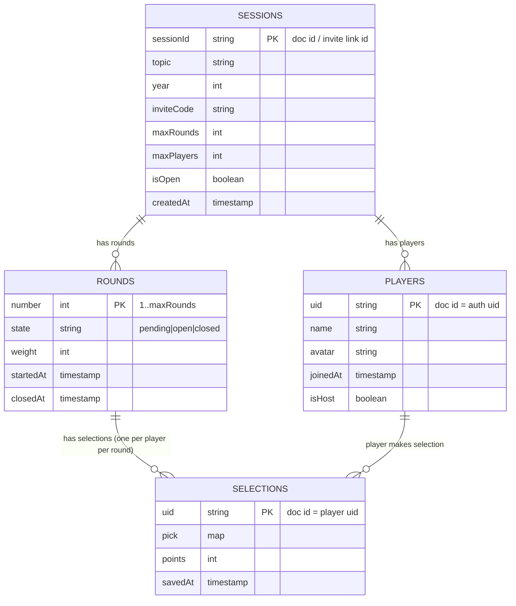

# Schema

User clicks Start, let up to ~10 ephemeral players join, store one pick per player per round with deterministic weighted points, and delete the entire session tree after round 10.

- sessions: single doc to share (invite link), holds rules (maxRounds/maxPlayers) and scope for all session data.
- players: session-scoped snapshots (name/avatar) stored under the session so there is no global users collection to clean up.
- rounds: explicit round docs with weight stored so scoring is deterministic and simple.
- selections: one doc per player per round (doc id = uid) storing pick and points so final tally is just a sum.
- timestamps and storing points at write-time make ordering, auditing, scoring, and cleanup straightforward.

This is the minimal set of collections/fields runs the game, prevents duplicate picks, computes the winner reliably, and removes all session data in one operation.
